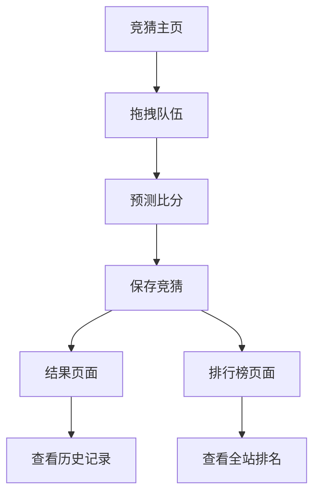

## 1. 产品概述

这是一个基于双败淘汰制的电竞锦标赛竞猜网页应用，用户可以通过拖拽队伍到对阵位置来进行比赛结果预测。产品主要服务于电竞爱好者，提供直观的可视化竞猜体验，增加观赛互动性。

目标市场价值：为电竞赛事提供互动竞猜平台，提升用户参与度和观赛体验。

## 2. 核心功能

### 2.1 用户角色

| 角色 | 注册方式 | 核心权限 |
|------|----------|----------|
| 普通用户 | 邮箱注册/游客模式 | 浏览赛事、进行竞猜、查看排行榜 |
| 管理员 | 后台创建 | 管理赛事数据、更新比赛结果、查看统计数据 |

### 2.2 功能模块

竞猜网页包含以下主要页面：
1. **竞猜主页**：阶段导航、倒计时提示、拖拽队伍列表、对阵图区域、排行榜、保存按钮
2. **结果页面**：显示用户预测准确率、历史竞猜记录
3. **排行榜页面**：全站用户竞猜排名展示

### 2.3 页面详情

| 页面名称 | 模块名称 | 功能描述 |
|----------|----------|----------|
| 竞猜主页 | 顶部导航栏 | 显示四个阶段标签（第一阶段、第二阶段、第三阶段、选拔阶段），支持阶段切换 |
| 竞猜主页 | 倒计时模块 | 显示"还剩X天可以竞猜"的倒计时提醒 |
| 竞猜主页 | 队伍列表 | 左侧垂直排列的队伍图标列表，支持拖拽操作 |
| 竞猜主页 | 对阵图区域 | 中央显示双败淘汰制对阵图，包含A/B/C/D四个小组，每组有胜者组和败者组 |
| 竞猜主页 | 淘汰赛区域 | 底部显示16强、8强、半决赛、决赛的晋级对阵图 |
| 竞猜主页 | 排行榜 | 右侧显示已激活用户排行榜，包含用户名和正确预测数 |
| 竞猜主页 | 保存按钮 | 右下角绿色确认按钮，保存用户当前的竞猜选择 |
| 结果页面 | 个人统计 | 显示用户预测准确率、总参与次数、正确次数 |
| 结果页面 | 历史记录 | 展示用户过往的竞猜记录和实际比赛结果对比 |
| 排行榜页面 | 全站排名 | 按预测准确率排序显示所有用户排名 |

## 3. 核心流程

### 用户竞猜流程
1. 用户进入竞猜主页，查看当前阶段和剩余时间
2. 从左侧队伍列表拖拽队伍到对阵图的空白位置
3. 为每场比赛预测获胜方和比分
4. 点击保存按钮提交竞猜结果
5. 系统记录用户预测数据

### 比赛结果更新流程
1. 管理员更新实际比赛结果
2. 系统自动计算用户预测准确率
3. 更新排行榜数据
4. 用户可以查看自己的预测结果

## 4. 用户界面设计

### 4.1 设计风格
- **主色调**：深紫色渐变背景（#2D1B69 到 #1A0B4D）
- **辅助色**：浅紫色卡片（#4C1D95），金色晋级标识，红色淘汰标识
- **按钮样式**：圆角矩形，3D悬浮效果，主要操作用绿色（#10B981）
- **字体**：中文使用思源黑体，英文使用Inter，正文字号14px，标题字号18-24px
- **布局风格**：卡片式布局，左右分栏设计，左侧队伍列表，中央对阵图，右侧排行榜
- **图标风格**：扁平化图标，使用emoji或简洁的线性图标

### 4.2 页面设计概览

| 页面名称 | 模块名称 | UI元素 |
|----------|----------|--------|
| 竞猜主页 | 背景 | 深紫色渐变背景，添加 subtle patterns 装饰纹理 |
| 竞猜主页 | 顶部导航 | 水平排列的白色文字标签，当前选中项高亮显示 |
| 竞猜主页 | 对阵卡片 | 紫色圆角卡片，白色边框，显示"对阵"标题和"?"占位符 |
| 竞猜主页 | 比分显示 | 白色文字显示比分（如3:0），晋级显示绿色"晋级"标签，淘汰显示红色"淘汰"标签 |
| 竞猜主页 | 队伍图标 | 圆形队伍徽标，支持拖拽时的半透明效果 |
| 竞猜主页 | 排行榜 | 深色半透明背景，白色文字显示用户名和正确预测数 |
| 竞猜主页 | 保存按钮 | 绿色圆形按钮，带白色勾选图标，悬浮时有放大效果 |

### 4.3 响应式设计
- **桌面优先**：主要针对1920x1080分辨率优化
- **移动端适配**：支持平板和手机浏览，对阵图在移动端变为垂直排列
- **触摸优化**：拖拽操作在触摸设备上有更大的触摸区域

### 4.4 交互细节
- 拖拽队伍时有半透明阴影效果
- 对阵卡片hover时有轻微上浮动画
- 保存成功后有绿色toast提示
- 倒计时数字有脉冲动画效果