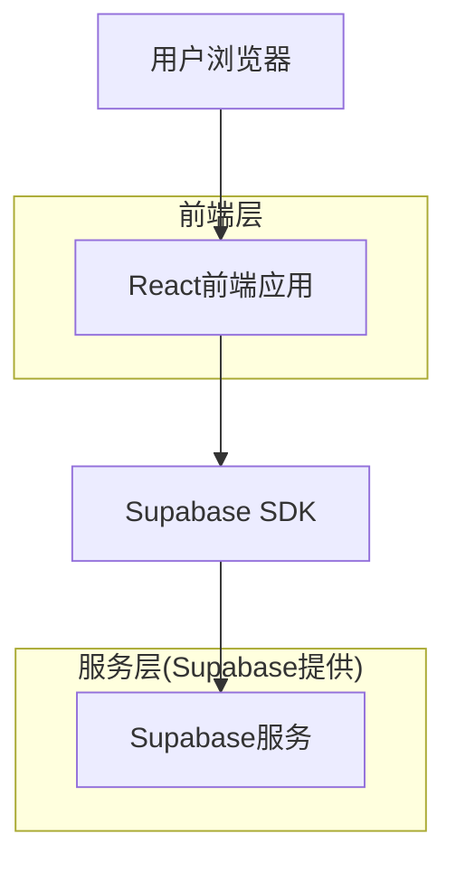
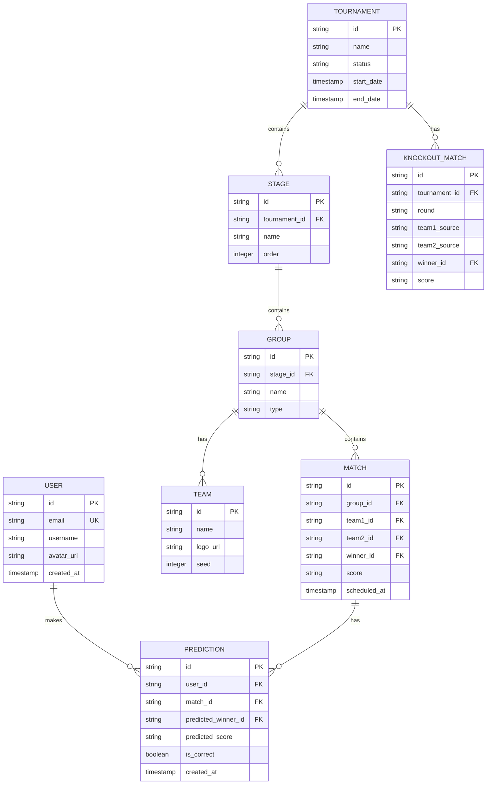

## 1. 架构设计



## 2. 技术描述

- **前端**: React@18 + tailwindcss@3 + vite
- **初始化工具**: vite-init
- **后端**: Supabase (BaaS)
- **拖拽库**: @dnd-kit/core (现代化拖拽解决方案)
- **状态管理**: React Context + useReducer
- **UI组件**: Headless UI + 自定义组件

## 3. 路由定义

| 路由 | 用途 |
|------|------|
| / | 竞猜主页，显示对阵图和拖拽功能 |
| /results | 结果页面，显示用户预测统计 |
| /leaderboard | 排行榜页面，显示全站排名 |
| /login | 登录页面 |
| /register | 注册页面 |

## 4. API定义

### 4.1 核心API

获取锦标赛数据
```
GET /api/tournament/:id
```

响应:
```json
{
  "id": "tournament_123",
  "name": "SF6锦标赛",
  "stages": [
    {
      "id": "stage_1",
      "name": "第一阶段",
      "groups": [
        {
          "id": "group_a",
          "name": "A组",
          "teams": [...],
          "matches": [...]
        }
      ]
    }
  ],
  "knockout_stage": {
    "round_of_16": [...],
    "quarter_finals": [...],
    "semi_finals": [...],
    "finals": [...]
  }
}
```

保存用户预测
```
POST /api/predictions
```

请求:
| 参数名 | 参数类型 | 是否必需 | 描述 |
|--------|----------|----------|------|
| user_id | string | true | 用户ID |
| tournament_id | string | true | 锦标赛ID |
| predictions | array | true | 预测数据数组 |

提交预测示例:
```json
{
  "user_id": "user_123",
  "tournament_id": "tournament_123",
  "predictions": [
    {
      "match_id": "match_1",
      "predicted_winner": "team_a",
      "predicted_score": "3:1"
    }
  ]
}
```

获取排行榜数据
```
GET /api/leaderboard
```

响应:
```json
{
  "leaderboard": [
    {
      "user_id": "user_123",
      "username": "玩家1",
      "correct_predictions": 15,
      "total_predictions": 20,
      "accuracy": 75
    }
  ]
}
```

## 5. 数据模型

### 5.1 数据模型定义



### 5.2 数据定义语言

用户表 (users)
```sql
-- 创建表
CREATE TABLE users (
  id UUID PRIMARY KEY DEFAULT gen_random_uuid(),
  email VARCHAR(255) UNIQUE NOT NULL,
  username VARCHAR(100) NOT NULL,
  avatar_url TEXT,
  created_at TIMESTAMP WITH TIME ZONE DEFAULT NOW()
);

-- 创建索引
CREATE INDEX idx_users_email ON users(email);
CREATE INDEX idx_users_username ON users(username);
```

锦标赛表 (tournaments)
```sql
CREATE TABLE tournaments (
  id UUID PRIMARY KEY DEFAULT gen_random_uuid(),
  name VARCHAR(255) NOT NULL,
  status VARCHAR(50) DEFAULT 'upcoming' CHECK (status IN ('upcoming', 'ongoing', 'completed')),
  start_date TIMESTAMP WITH TIME ZONE,
  end_date TIMESTAMP WITH TIME ZONE,
  created_at TIMESTAMP WITH TIME ZONE DEFAULT NOW()
);
```

队伍表 (teams)
```sql
CREATE TABLE teams (
  id UUID PRIMARY KEY DEFAULT gen_random_uuid(),
  name VARCHAR(255) NOT NULL,
  logo_url TEXT,
  seed INTEGER,
  created_at TIMESTAMP WITH TIME ZONE DEFAULT NOW()
);
```

比赛表 (matches)
```sql
CREATE TABLE matches (
  id UUID PRIMARY KEY DEFAULT gen_random_uuid(),
  group_id UUID REFERENCES groups(id),
  team1_id UUID REFERENCES teams(id),
  team2_id UUID REFERENCES teams(id),
  winner_id UUID REFERENCES teams(id),
  score VARCHAR(10),
  scheduled_at TIMESTAMP WITH TIME ZONE,
  created_at TIMESTAMP WITH TIME ZONE DEFAULT NOW()
);

CREATE INDEX idx_matches_group ON matches(group_id);
CREATE INDEX idx_matches_teams ON matches(team1_id, team2_id);
```

预测表 (predictions)
```sql
CREATE TABLE predictions (
  id UUID PRIMARY KEY DEFAULT gen_random_uuid(),
  user_id UUID REFERENCES users(id),
  match_id UUID REFERENCES matches(id),
  predicted_winner_id UUID REFERENCES teams(id),
  predicted_score VARCHAR(10),
  is_correct BOOLEAN,
  created_at TIMESTAMP WITH TIME ZONE DEFAULT NOW(),
  UNIQUE(user_id, match_id)
);

CREATE INDEX idx_predictions_user ON predictions(user_id);
CREATE INDEX idx_predictions_match ON predictions(match_id);
```

### 5.3 Supabase权限设置

```sql
-- 基本读取权限
GRANT SELECT ON tournaments TO anon;
GRANT SELECT ON teams TO anon;
GRANT SELECT ON matches TO anon;
GRANT SELECT ON predictions TO anon;

-- 认证用户完整权限
GRANT ALL PRIVILEGES ON tournaments TO authenticated;
GRANT ALL PRIVILEGES ON teams TO authenticated;
GRANT ALL PRIVILEGES ON matches TO authenticated;
GRANT ALL PRIVILEGES ON predictions TO authenticated;
GRANT ALL PRIVILEGES ON users TO authenticated;

-- RLS策略示例
ALTER TABLE predictions ENABLE ROW LEVEL SECURITY;

CREATE POLICY "用户只能查看自己的预测" ON predictions
  FOR SELECT USING (auth.uid() = user_id);

CREATE POLICY "用户只能创建自己的预测" ON predictions
  FOR INSERT WITH CHECK (auth.uid() = user_id);

CREATE POLICY "用户只能更新自己的预测" ON predictions
  FOR UPDATE USING (auth.uid() = user_id);
```

## 6. 前端组件架构

### 6.1 核心组件结构

```
src/
├── components/
│   ├── layout/
│   │   ├── Header.jsx          // 顶部导航
│   │   ├── Sidebar.jsx         // 左侧队伍列表
│   │   └── Leaderboard.jsx     // 右侧排行榜
│   ├── bracket/
│   │   ├── TournamentBracket.jsx // 主对阵图组件
│   │   ├── GroupStage.jsx      // 小组赛组件
│   │   ├── KnockoutStage.jsx   // 淘汰赛组件
│   │   ├── MatchCard.jsx       // 比赛卡片
│   │   └── TeamDragItem.jsx    // 可拖拽队伍项
│   ├── ui/
│   │   ├── Button.jsx
│   │   ├── Card.jsx
│   │   ├── Timer.jsx           // 倒计时组件
│   │   └── Toast.jsx
│   └── providers/
      ├── DragDropProvider.jsx  // 拖拽上下文
      └── TournamentProvider.jsx // 数据上下文
```

### 6.2 状态管理

使用React Context管理全局状态：

```javascript
// TournamentContext
const TournamentContext = createContext({
  tournament: null,
  predictions: {},
  updatePrediction: () => {},
  savePredictions: () => {},
  loading: false,
  error: null
});
```

### 6.3 拖拽实现

使用@dnd-kit实现拖拽功能：

```javascript
import { DndContext, DragOverlay } from '@dnd-kit/core';

function DragDropProvider({ children }) {
  const [activeId, setActiveId] = useState(null);
  
  return (
    <DndContext onDragStart={({ active }) => setActiveId(active.id)}>
      {children}
      <DragOverlay>
        {activeId ? <TeamDragItem id={activeId} /> : null}
      </DragOverlay>
    </DndContext>
  );
}
```